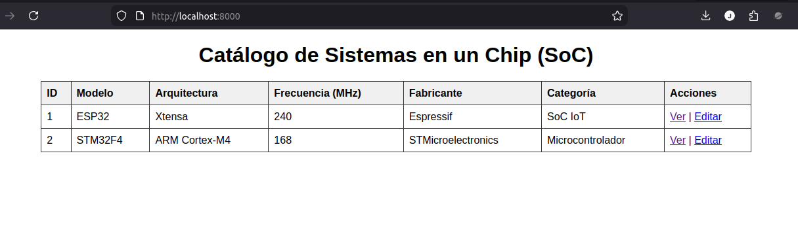
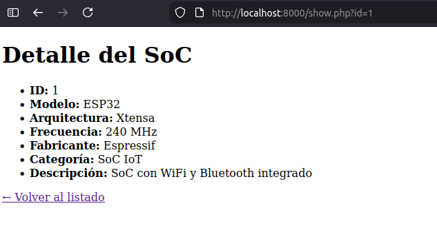
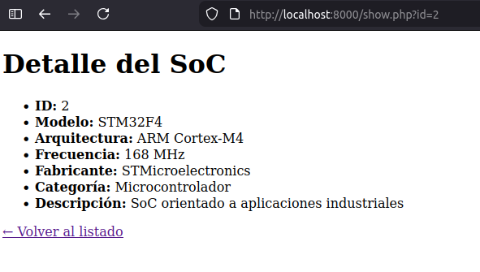
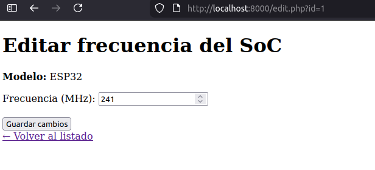
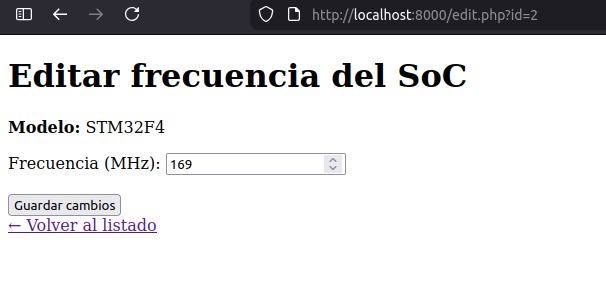

# Catálogo de Sistemas en un Chip (SoC)

## Descripción general

Este repositorio contiene un **ejercicio de desarrollo personal** orientado a consolidar conceptos de **backend**, **bases de datos relacionales** y **arquitectura MVC**, aplicados a un dominio técnico real: el catálogo de **Sistemas en un Chip (SoC)**.

El proyecto se desarrolla de forma incremental y consciente, priorizando:
- claridad de diseño
- separación de responsabilidades
- simplicidad técnica
- reutilización de componentes

No se persigue el uso de frameworks ni herramientas externas innecesarias, sino el entendimiento profundo de los fundamentos.

---

## Enfoque del desarrollo

El trabajo se divide en **dos etapas complementarias**:

### 1. Diseño y validación del backend (Jupyter Notebook)
- Modelado de la base de datos relacional.
- Creación de tablas y relaciones.
- Conexión remota a PostgreSQL (Neon.tech).
- Operaciones CRUD.
- Validaciones y pruebas de integridad.
- Uso de Python como entorno de análisis y validación.

El notebook actúa como **laboratorio de diseño**, permitiendo validar el backend antes de cualquier desarrollo web.

---

### 2. Implementación web en PHP (MVC)
- Conexión PHP → PostgreSQL mediante PDO.
- Implementación explícita del patrón MVC.
- Separación clara entre:
  - Modelo (acceso a datos)
  - Controlador (lógica de aplicación)
  - Vista (presentación HTML)
- Operaciones:
  - Listado de SoC
  - Vista de detalle
  - Edición de una característica (frecuencia)

La aplicación se ejecuta usando el **servidor web integrado de PHP**, sin dependencias externas.

---

## Tecnologías utilizadas

- PostgreSQL (Neon.tech)
- SQL
- Python 3
- Jupyter Notebook
- PHP 8+
- PDO (pgsql)
- HTML + CSS mínimo embebido
- Linux

---

## Estructura del repositorio

```
catalogo-soc/
│
├── capturas/
│   ├── tablacatalogo.png
│   ├── detalle1.png
│   ├── detalle2.png
│   ├── editando1.png
│   └── editando2.png
│
├── notebook/
│   └── Ejercicio_Catálogo_SoC.ipynb
│
├── php/
│   ├── config/
│   │   └── database.php
│   ├── controllers/
│   │   └── SocController.php
│   ├── models/
│   │   └── SocModel.php
│   ├── views/
│   │   ├── soc_list.php
│   │   ├── soc_detail.php
│   │   └── soc_edit.php
│   ├── index.php
│   ├── show.php
│   ├── edit.php
│   └── archivos de prueba (test_*.php)
│
├── sql/
│
└── README.md
```

---

## Funcionalidades implementadas

- ✔ Conexión remota segura a PostgreSQL
- ✔ Listado de SoC (READ)
- ✔ Vista de detalle por SoC (READ)
- ✔ Edición de una característica (UPDATE)
- ✔ Patrón MVC aplicado de forma explícita
- ✔ Salidas HTML limpias sin frameworks

---

## Capturas de la aplicación

| Vista | Captura |
|------|--------|
| Catálogo de SoC |  |
| Detalle de SoC (1) |  |
| Detalle de SoC (2) |  |
| Edición de SoC (1) |  |
| Edición de SoC (2) |  |

---

## Ejecución de la aplicación PHP

Desde la carpeta `php/`:

```bash
php -S localhost:8000
```

Luego abrir en el navegador:

```
http://localhost:8000
```

---

## Motivación

Este ejercicio no corresponde a una entrega formal, sino a **práctica consciente de desarrollo backend**, con énfasis en:
- comprender el flujo completo de una aplicación
- evitar dependencias innecesarias
- reforzar fundamentos reutilizables en cualquier lenguaje o framework

---

## Autor

Proyecto de desarrollo personal con fines educativos y de mejora profesional.

---

## Licencia

Uso libre con fines educativos.
