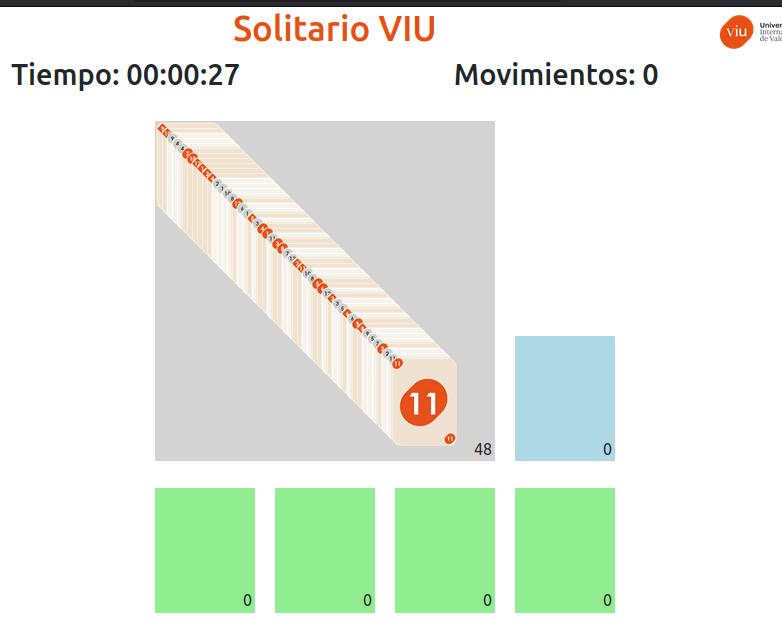
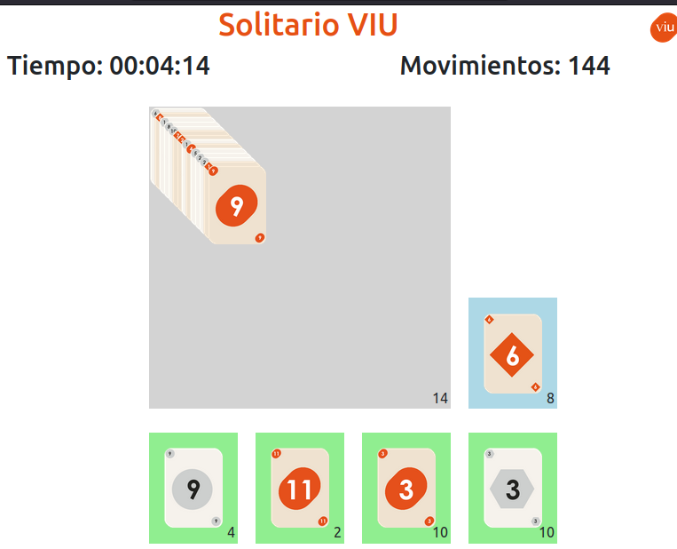

# Actividad 1 – Solitario Web (Frontend)

Este trabajo corresponde a la **Actividad 1** de la asignatura **Web Frontend**
del **Máster en Desarrollo Web – Universidad Internacional de Valencia (VIU)**.

La aplicación implementa un **juego de solitario desarrollado en HTML, CSS y JavaScript**,
funcionando completamente en el lado del cliente, sin dependencias externas ni backend.

Esta versión se considera **estable y funcional (v1.0)**, y se utiliza
como base para la evolución del proyecto mediante control de versiones.

---

## Estructura del proyecto
```
Actividad1_solitario/
├── solitario.html
├── css/
│   └── estilos.css
├── js/
│   └── script.js
└── imagenes/
    └── Recursos gráficos del juego
```
---

## 🚀 Funcionalidades principales

- **Generación dinámica del mazo inicial** con cartas personalizadas.
- **Barajado aleatorio** de cartas.
- **Contadores en tiempo real** para cada tapete:
  - mazo inicial,
  - cartas sobrantes,
  - tapetes receptores.
- **Drag & Drop** para mover cartas entre tapetes.
- **Reglas de juego implementadas**:
  - Solo se puede iniciar un tapete receptor con carta **12**.
  - Las cartas deben colocarse en **orden descendente**.
  - Se debe **alternar el color** de las cartas.
- **Reciclaje automático** de las cartas sobrantes al mazo inicial.
- **Temporizador** en formato `hh:mm:ss`.
- **Botón de reinicio** que limpia todos los tapetes y reinicia contadores y tiempo.

---

## 🖥️ Cómo ejecutar el proyecto

1. Clonar este repositorio o descargar la carpeta `Actividad1_solitario`.
2. Acceder a la carpeta del proyecto.
3. Abrir el archivo `solitario.html` en cualquier navegador web moderno
   (Firefox, Chrome, Chromium, etc.).
4. ¡Jugar y disfrutar! 

No se requiere servidor web ni configuración adicional.

---

## 🛠️ Tecnologías utilizadas

- HTML5
- CSS3
- JavaScript (ES6)
- API Drag & Drop del navegador

---

## 📸 Capturas de referencia

### Vista inicial del solitario


### Juego en progreso


---

## Estado del proyecto

- Aplicación completamente funcional
- Versión actual: **v1.0**

---

## Próximas versiones

- Mejorar estilos visuales y ¿añadir animaciones? CSS.
- Incorporar nuevas reglas o variaciones del solitario.

---

## Autor

Actividad desarrollada a partir de una plantilla otorgada.
Estudiante del Máster en Desarrollo Web – VIU.
