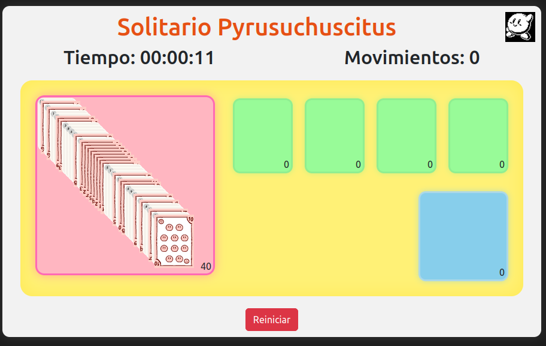
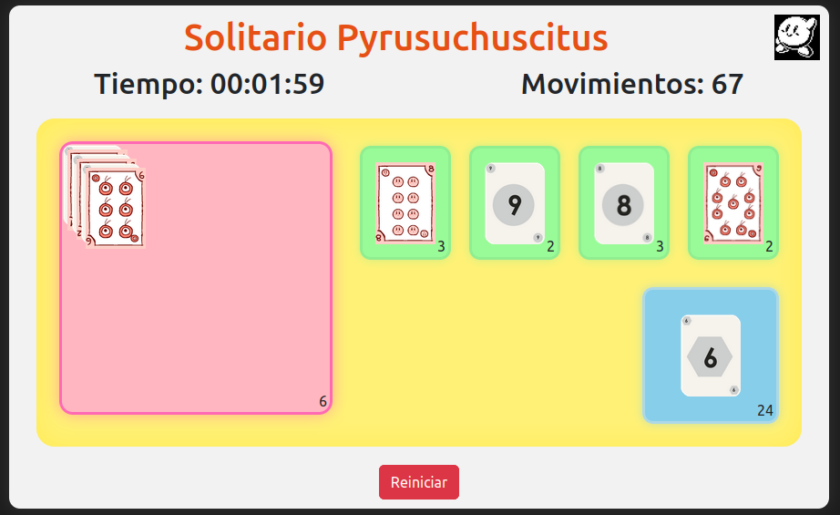

# 🃏 Solitario Libre

Este proyecto corresponde a un **ejercicio práctico de desarrollo frontend**, 
cuyo objetivo principal fue **aprender, experimentar y consolidar conocimientos** 
en JavaScript, HTML, CSS y consumo básico de una API.

El juego no pretende ser un producto final ni comercial, sino una **experiencia de 
aprendizaje guiada**, donde se fueron resolviendo problemas reales paso a paso.

---

## ¿Qué es este solitario?

Un solitario clásico… **pero no tan clásico**.

El juego funciona como se espera, pero incluye algunas pequeñas libertades,
como la aparición ocasional de un **comodín especial (Metaknight)** que puede
ayudar a reducir movimientos cuando la partida se complica.

No aparece siempre.  
No es fácil de usar.  
Y no garantiza ganar.

Está ahí solo para hacer el juego un poco menos rígido y un poco más divertido.

---

## Descripción del juego

Solitario clásico con:
- Contador de tiempo
- Contador de movimientos
- Condición clara de fin de juego
- Ranking de mejores puntajes (menos movimientos = mejor resultado)

Para efectos de demostración pública (GitHub Pages), el ranking puede mostrarse 
en **modo ficticio**, evitando exponer credenciales reales de base de datos.

---

## Ranking

- El ranking real se gestiona mediante un backend (PHP + base de datos).
- Para la versión pública, se implementa un **ranking local ficticio** que:
  - Evita errores
  - Permite visualizar cómo se mostraría el ranking completo
  - Mantiene el juego totalmente funcional

---

## 📸 Capturas

### Vista inicial

### Juego en progreso

---

## Estado del proyecto

- ✔ Funcional
- ✔ Jugable
- ✔ Enfocado en aprendizaje
- ✔ Código comentado y entendible
- 🚧 Aún perfectible (como todo proyecto educativo)

---

## Agradecimientos

Este proyecto fue desarrollado como parte de un proceso de aprendizaje personal,  
con apoyo y acompañamiento técnico de **ChatGPT y Copilot**, utilizado como 
herramienta de guía, reflexión y ayuda para resolver problemas específicos.

Las decisiones finales, pruebas y ajustes fueron realizados de forma consciente 
como parte del proceso educativo.

---

## Nota final

Si este proyecto te resulta útil como referencia, inspiración o ejercicio, 
siéntete libre de revisarlo, adaptarlo o mejorarlo.

Aprender programando, equivocándose y corrigiendo, **es parte del camino**.

